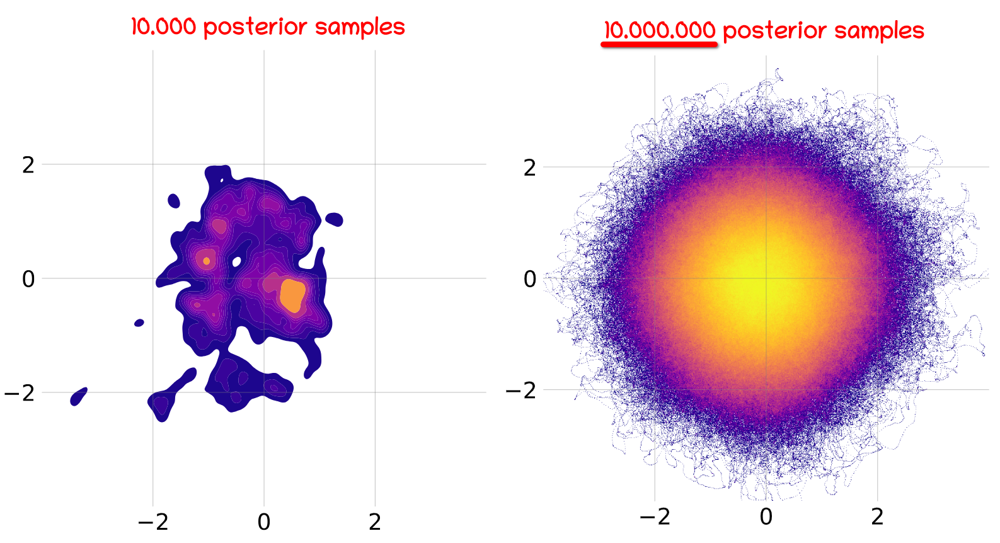

# Approximate Posteriors in Neural Networks: A Sampling Perspective

This repository contains the code for the **FPI @ ICLR (2025, oral) & AABI 2025 workshop paper: Approximate Posteriors in Neural Networks: A Sampling Perspective**. 

Below as a teaser you can see a (marginal) view on the approximate posterior obtained by sampling ...

<p align="center">
    
</p>

Got your attention? Then take a closer look at the paper!

## Project Structure

```
.
├── experiments     Python scripts for experiments and figures.
    └── configs     Config files for experiments.
    └── figures     Python scripts to reproduce figures.
├── data            Data files.
├── Rcode           R scripts to reproduce figures.
├── src             Python modules.
└── results         Git ignored directory for storing results.
```

## Python Setup (using poetry)

```bash
git clone
cd sampled-approx-posteriors
# Possibly create a fresh virtual environment and activate it
poetry install
```

All python scripts to generate figures and results can be found in the `experiments` directory. Most scripts can be run interactively
using VSCode inline magic `#%%`.

## Run Experiments

Create a (gitignored) `results/` folder to store the results:

```bash
mkdir results
```

The individual experiments can be executed in parallel across CPU or GPU cores (with appropriate ENV variables set for your hardware), using the flag `-d`:

```bash
python python -m src.sai -d 12 -c experiments/configs/permuted_warmstarts.yaml
```

When a whole grid of experiments is to be run, the `-s` argument providing a the grid is used:

```bash
python -m src.sai -d 10 -c experiments/configs/mile_mean_regr_uci.yaml -s experiments/configs/tabular_search.yaml
```

The results in the respective subfolder of `results/` contain:

- The `config.yaml` configuration file describing the experiment.
- The trained warm-start models inside the `warmstart/` folder.
- The posterior samples in the `samples/` folder.
- Diagnostics and training logs.

**Utils:** We also provide utility CLI tools that 1) aggregate multiple experiments (`experiments/pool_results.py`) and 2) save a subset of traces for large experiments (`experiments/save_traces.py`).

> **Note:** Much of the SAI code is based/inspired on the original [MILE codebase](https://anonymous.4open.science/r/MILE-1CC1/README.md) (Sommer et al., 2025).

## Figures

Based on the (further aggregated) results of the experiments the figures can be generated using the scripts in the `experiments/figures` directory.

The source code for the figures produced with the R programming language is located in the `Rcode/` directory and was created with R version `4.4.1` and `{ggplot2}` version `3.5.1`.

> **Note:** The across and within layer grid of marginal bivariate densities of the large experiment with 10M posterior samples (`experiment/configs/scale_regr_mile.yaml`) are shipped with the repository within the `data/fireball/mile_air/marginal_densities/` folder. The two numbers like `1_2` in the file names refer to the layer indices.